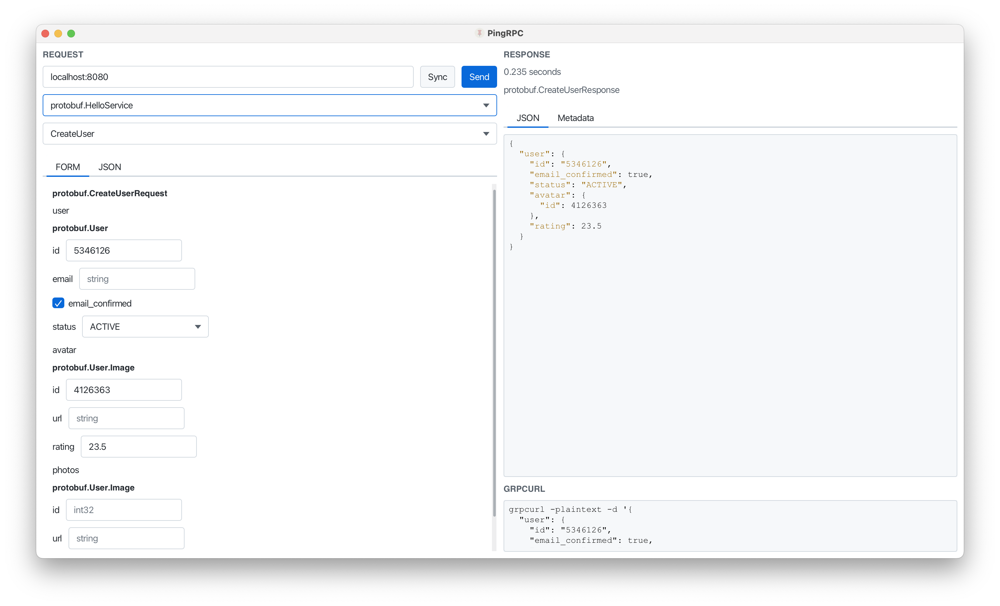

# PingRPC

Cross platform gRPC client

## Development

Use `--server` flag to run gRPC server on `localhost:8080` (e.g., `sbt 'run --server'`)

Service is defined in [src/main/protobuf/hello.proto](src/main/protobuf/hello.proto)
